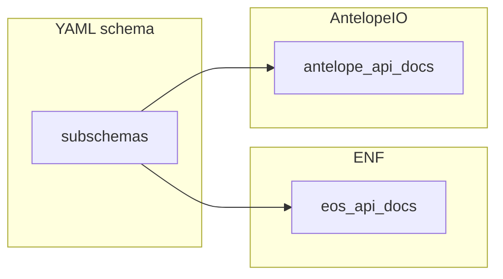

# Summary
The open API files have nested references to schemas. These schema's are shared across ENF and Antelope document repositories, and they are versioned separately from the document repositories they support.

# What
API documentation is presented in the documentation. Each of the following items is represented by a YAML file in the `AntelopeIO/leap` repository under the associated `plugins` folder. You can see the rendered version of the API docs on the [API Reference Page](https://docs.antelope.io/docs/latest/api-listing). Each of the following API documents references subschemas on a full URL path.

- Nodeos Chain API: Provides access to the blockchain information and interaction with the blockchain
- Nodeos Producer API: Provides access to a producer node
- Nodeos Net API: Provides access to the blockchain's network
- Nodeos DB Size API: Provides access to the blockchain's database
- Nodeos Trace API: Provides access to retired actions and related metadata from a specified block

An example of a full URL path for a subschema is [https://docs.eosnetwork.com/openapi/v2.0/Name.yaml](https://docs.eosnetwork.com/openapi/v2.0/Name.yaml).

# How It Works
The `[redocly](https://redocly.com/0` code is run by Docusaurus as a plugin `redocusaurus`. This plugin parses the YAML file for the main `leap` apis. As the YAML files are parsed the URL for the subschema is extracted and the contents are downloaded.

